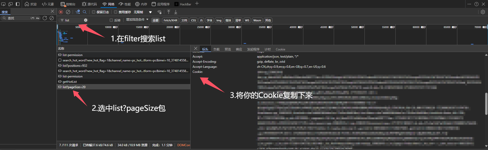

# CSDN2Local

一个帮助你将**你自己**的CSDN博客保存到本地markdown格式的脚本。方便博客归档和迁移。

## 使用教程

1.登录CSND 打开创作中心->内容管理

2.打开F12开发工具，并刷新界面

3.复制你的cookie，并将其保存到`config.yaml`的`cookie`字段中。

4.运行main.py

## 注意事项
只支持保存自己的CSDN博客哦。